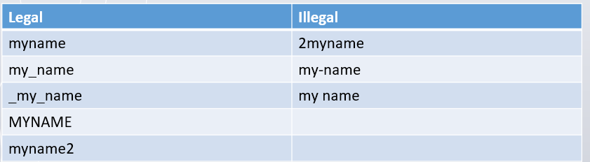
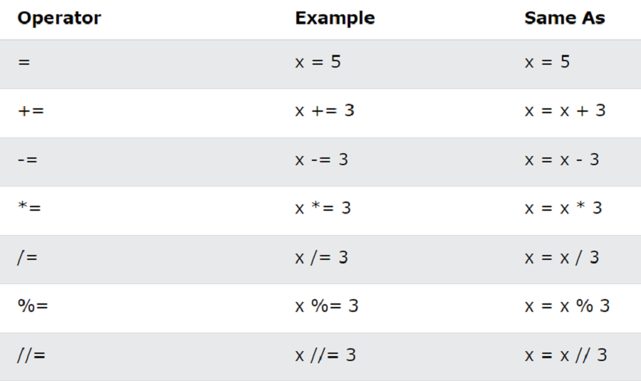
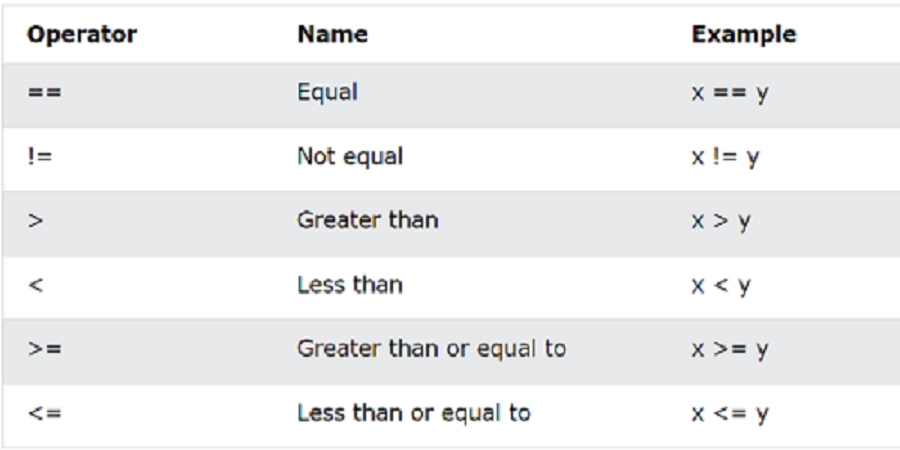
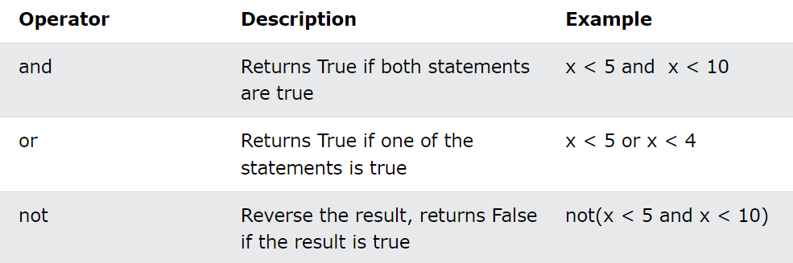
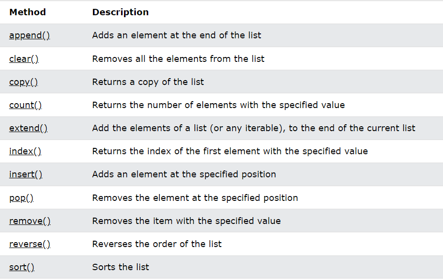
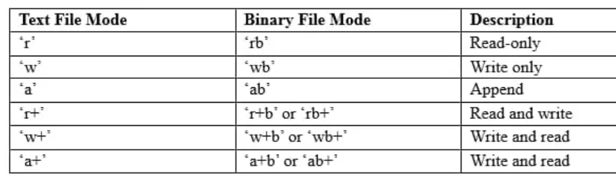

# Basic Python
## Author : Rafsan Bin Firoz
# Chapter 1.0
## What is Python ?
Python is an :
* High Level Programming Language 
* Interpreted
* Object Oriented 
## What is Python used for 
* Web Development:
Frameworks like Django and Flask allow for efficient web application development. 
* Data Analysis: 
Libraries such as Pandas and NumPy are widely used in data science.
* Machine Learning: TensorFlow and scikit-learn help in building ML models.

* Automation: Scripts can automate repetitive tasks.

## Why Python?

* Python works on different platforms (Windows, Mac, Linux, Raspberry Pi, etc). 
* Python has a simple syntax similar to the English language. 
* Python has syntax that allows developers to write programs with fewer lines than some other programming languages.  
* Python runs on an interpreter system, meaning that code can be executed as soon as it is written. This means that prototyping can be very quick.  
* Python can be treated in a procedural way, an object-oriented way or a functional way.

# Chapter 2.0
## 2.1 Installation
## 2.1.1  Windows:
### Download Python:
Go to the official Python website.
Click on the "Download Python" button (the latest version).
### Run the Installer:
Open the downloaded .exe file.
Make sure to check the box that says "Add Python to PATH" before clicking "Install Now."
### Complete Installation:
Once the installation is complete, you can close the installer.
### Verify Installation:
Open Command Prompt and type python --version or python to check if Python is installed correctly.
## 2.1.2  macOS
### Download Python:
Go to the official Python website.
Click on the "Download Python" button (the latest version).

### Run the Installer:

Open the downloaded .pkg file.
Follow the on-screen instructions to complete the installation.

### Verify Installation:

Open Terminal and type python3 --version or python3 to check if Python is installed correctly.

## 2.2 Installing an IDE

You may also want to install an Integrated Development Environment (IDE) or code editor to write your Python code. Here are a few popular options:

## 2.2.1 PyCharm:

Go to the PyCharm website.
Download the Community Edition (free).
Follow the installation instructions.
Visual Studio Code:

## 2.2.2 VSCode

Go to the VSCode website.
Download the installer for your operating system.
Follow the installation instructions.

# Chapter 3.0

## 3.1 Data Types :

Integer (int ) : whole number, e.g. -2 ,-1,0,1,2  
Floats (float): Decimal number e.g. -0.25 ,3.5,4.2  
Strings (str) :  Sequence of Character e.g “Hello World” 
Boolean (bool) : Represent truth values e.g. true ,false  

## 3.2 Variables:

A variable is a name that refers to a value stored in memory

Naming Rule :
* Must start with letters or underscore .Variable name cannot start with numbers
* Can contain letter,digit,underscore.
* Case-sensitive : e.g. age is different from Age

  

## 3.3 Backslash & Comment :

For Singkle line comment we use ( # )  
For Multiple line comment we use (***Your Comment *** ) 

\n = New Tab

# Chapter 4
## 4.1 Operator :

## 4.1.1 Arithmatic Operator:

## 4.1.2 Assignment Operator:

## 4.1.3 Compare Operator:

## 4.1.4 Logical operator:

# Chapter 5.0
## 5.1 List & Array 

Lists are used to store multiple items in a single variable.

Arrays are used to store multiple values in one single variable:

## 5.1.1 Creating a List
* Lists are created using square brackets and comma:

Example :

    my_list = [1, 2, 3, 4, 5] 
    mixed_list = [1, "two", 3.0, True]

## 5.1.2 Accessing List Elements

* List items are indexed and you can access them by referring to the index number.

* The first item has index 0.

Example:
Print the first item of the list:

    thislist = ["apple", "banana", "cherry"]
    print(thislist[0])
    Run Result: apple

## 5.1.3 Negative Indexing

* Negative indexing means start from the end
-1 refers to the last item, -2 refers to the second last item etc.

Example:

    thislist = ["apple", "banana", "cherry"]
    print(thislist[-1])
    Run Result : cherry

## 5.1.4 Range of Indexes

* Return the third, fourth, and fifth item:

Example:

    thislist = ["apple", "banana", "cherry", "orange", "kiwi", "melon", "mango"]
    print(thislist[2:5])
    Run Result: ['cherry', 'orange', 'kiwi']

## 5.1.5 Change Item Value

Example:

    thislist = ["apple", "banana", "cherry"]
    thislist[1] = "blackcurrant"
    print(thislist)
    Run Result :  ['apple', 'blackcurrant', 'cherry']

## 5.1.6 Add Item List 

* To add an item to the end of the list, use the append() method:

Example:

    thislist = ["apple", "banana", "cherry"]
    thislist.append("orange")
    print(thislist)
    Run Result: ['apple', 'banana', 'cherry', 'orange']

## 5.1.7 Insert Items

* Insert a list item at a specified index, use the insert() method.

* The insert() method inserts an item at the specified index:

Example:

    thislist = ["apple", "banana", "cherry"]
    thislist.insert(1, "orange")
    print(thislist)
    Run Result:
    ['apple', 'orange', 'banana', 'cherry']

## 5.1.8 Remove List Items

* The remove() method removes the specified item.

      thislist = ["apple", "banana", "cherry"]
      thislist.remove("banana")
      print(thislist)
      Rub Result: ['apple', 'cherry']

## 5.1.9 Remove Specified Index

* The pop() method removes the specified index.

      thislist = ["apple", "banana", "cherry"]
      thislist.pop(1)
      print(thislist)
      Run Result: ['apple', 'cherry']

## 5.1.10 Loop Through a List
Example:

    thislist = ["apple", "banana", "cherry"]
    for x in thislist:
      print(x)
    Run Result : 
    apple
    banana
    cherry

## 5.1.11 Loop Through the Index Numbers

* You can also loop through the list items by referring to their index number.

* Use the range() and len() functions to create a suitable iterable.
Example:

          thislist = ["apple", "banana", "cherry"]
          for i in range(len(thislist)):
            print(thislist[i])
          Run Result:
          apple
          banana
          cherry

## 5.1.12 List Methods

## 5.2.1 Access the element of array
    car1 = "Ford"
    car2 = "Volvo"
    car3 = "BMW"
    x = cars[0]

## 5.2.2 The Length of an Array
* Return the number of elements in the cars array:

    
       x = len(cars)

#Other Section are similar to list .

# Chapter 6.0

## 6.1 Control Flow

## 6.1.1 If...else

* if checks the first condition
* elif keyword is Python's way of saying "if the previous conditions were not true, then try this condition
* The else keyword catches anything which isn't caught by the preceding conditions

Example :

    a = 200 
    b = 33
    if b > a:
      print("b is greater than a")
    elif a == b:
      print("a and b are equal")
    else:
      print("a is greater than b")
    Run Result:
    a is greater than b

## 6.2 Loop Statement

## 6.2.1 While Loop

* With the while loop we can execute a set of statements as long as a condition is true.

Example:

    i = 1 
    while i < 6:
      print(i)
      i += 1 
      #Print i as long as i is less than 6:
    Run Result:
    1
    2
    3
    4
    5

## Break Statement:
With the break statement we can stop the loop even if the while condition is true:

Example:

    i = 1
    while i < 6:
      print(i)
      if i == 3:
      break
      i += 1 # Exit the loop when i is 3:

## 6.3 For Loop

* The for loop is used to iterate over a sequence (like a list, tuple, string, or range) and execute a block of code for each item.

Example:

    fruits = ["apple", "banana", "cherry"]
    for fruit in fruits:
        print(fruit) 
    Run result:
    apple
    banana
    cherry

Using range() :

    for i in range(5):
        print(i)
    Run Result:    
    0
    1
    2
    3
    4

# Chapter 7.0

## 7.1 Function

### 7.1.1 Creating a Function

* In Python a function is defined using the def keyword

Example:

    def my_function():
      print("Hello from a function")

### 7.1.2 Calling a Function

* To call a function, use the function name followed by parenthesis:

Example :

    def my_function():
      print("Hello from a function")
    my_function()

## 7.1.3 Returning a value from function

      def add (a,b) :
      sum = a+b 
      return sum 
      result=add(10,20) #calling function & store it in result variable
      print(result)

### Chapter 8.0
## Classes and Objects
## 8.1.1  Create class 
* Class name must start with capital letter
* Create a class named MyClass, with a property named x:
Example:

      class MyClass:
        x = 5

## 8.1.2 Create Object

* Create an object named p1, and print the value of x:

      p1 = MyClass()
      print(p1.x)
      Run result: 5

## 8.2 Inheritence

* allows a class (known as a child or derived class) to inherit attributes and methods from another class (known as a parent or base class). 

## 8.2.1 Create a Parent Class

* Parent or Base Class: First, we'll create a base class called Animal. This class will have common attributes and methods for all animals.

class Animal:
    def __init__(self, name, species):
        self.name = name
        self.species = species

    def speak(self):
        return f"{self.name} makes a sound."

    def info(self):
        return f"{self.name} is a {self.species}."

* Child Class: ext, we'll create a Dog class that inherits from the Animal class. The Dog class will have its own method and override the speak method.

class Dog(Animal):
    def __init__(self, name, breed):
        super().__init__(name, species="Dog")  # Call the base class constructor
        self.breed = breed

    def speak(self):
        return f"{self.name} barks."

    def info(self):
        return f"{self.name} is a {self.breed} dog."
## 8.3 Polymorphism

* The word "polymorphism" means "many forms", and in programming it refers to methods/functions/operators with the same name that can be executed on many objects or classes.

        class Dog(): 
            def animal_kingdom(self): 
              print("Mammal") 
            def legs(self):
              print("Four") 
        class Lizard(): 
            def animal_kingdom(self): 
              print("Mammal") 
            def legs(self): 
              print("Four") 
        def function1(obj): 
              obj.animal_kingdom() 
              obj.legs()
        obj_dog = Dog() 
        obj_lizard = Lizard() 
        function1(obj_dog) 
        function1(obj_lizard)
        Output
        Mammal
        Four
        Mammal
        Four

Explanation:
In the above example, the function, function1() takes in an object named obj, which in turn lets the functions call the methods, animal_kingdom() and legs() of both the classes, Dog and Lizard. To do this, we must create the instances of both classes.

## 8.4 Exception Handling
## 8.4.1 Try and Catch
* The try block lets you test a block of code for errors.

* The except block lets you handle the error.

* The else block lets you execute code when there is no error.

* The finally block lets you execute code, regardless of the result of the try- and except blocks.

When an error occurs, or exception as we call it, Python will normally stop and generate an error message.

These exceptions can be handled using the try statement:

    try:
        # Code that may cause an exception
    except ExceptionType:
        # Code to handle the exception 

# Chapter 9.0
## Flile Handling 
## 9.1 Opening File modes 

## 9.2 File Handling Process

    import os
    if not os.path.exists('example.txt'):  
        with open('example.txt', 'w') as file: #Create and write to the file
            file.write("Hello, World!\n")
            file.write("This is a second line.\n")
    with open('example.txt', 'r') as file: Read from the file
        content = file.readlines()
        for line in content:
            print(line.strip())      
    with open('example.txt', 'a') as file: #Append to the file
        file.write("Appending a new line.\n")
    os.remove('example.txt') #Delete the file

